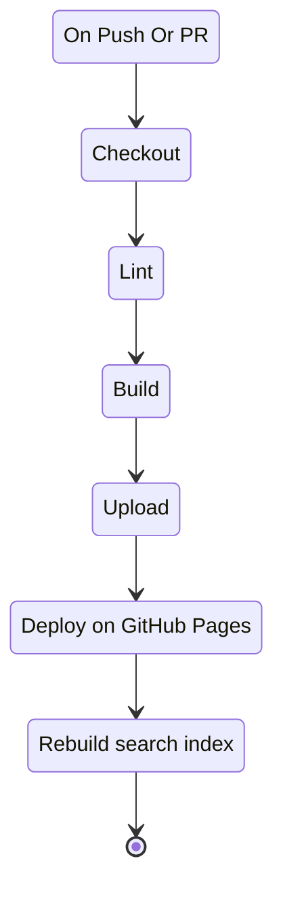
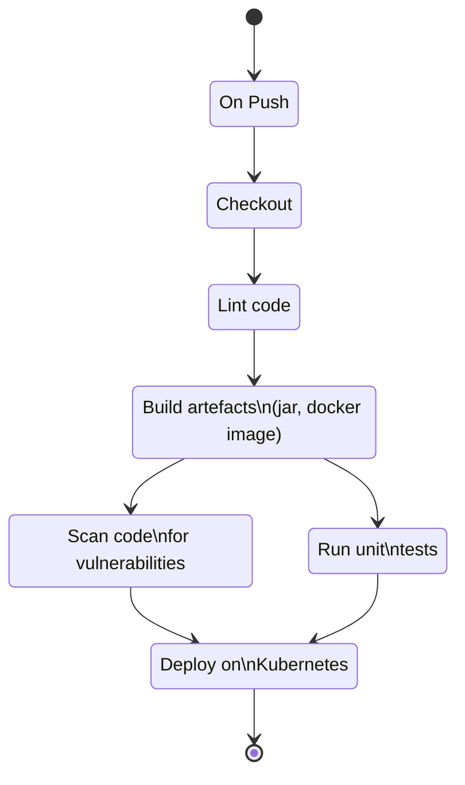
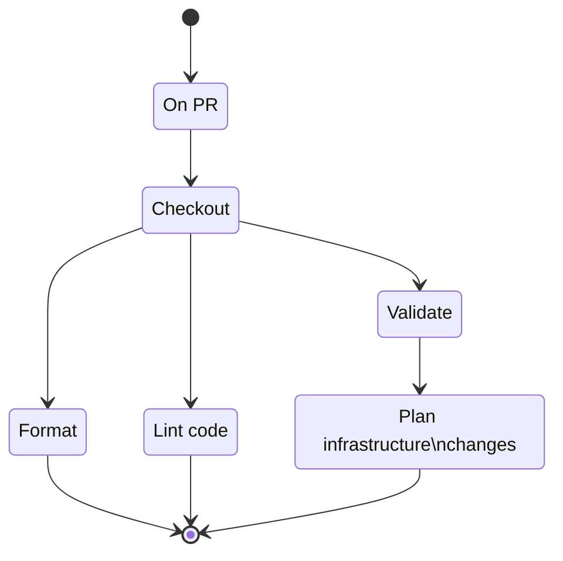
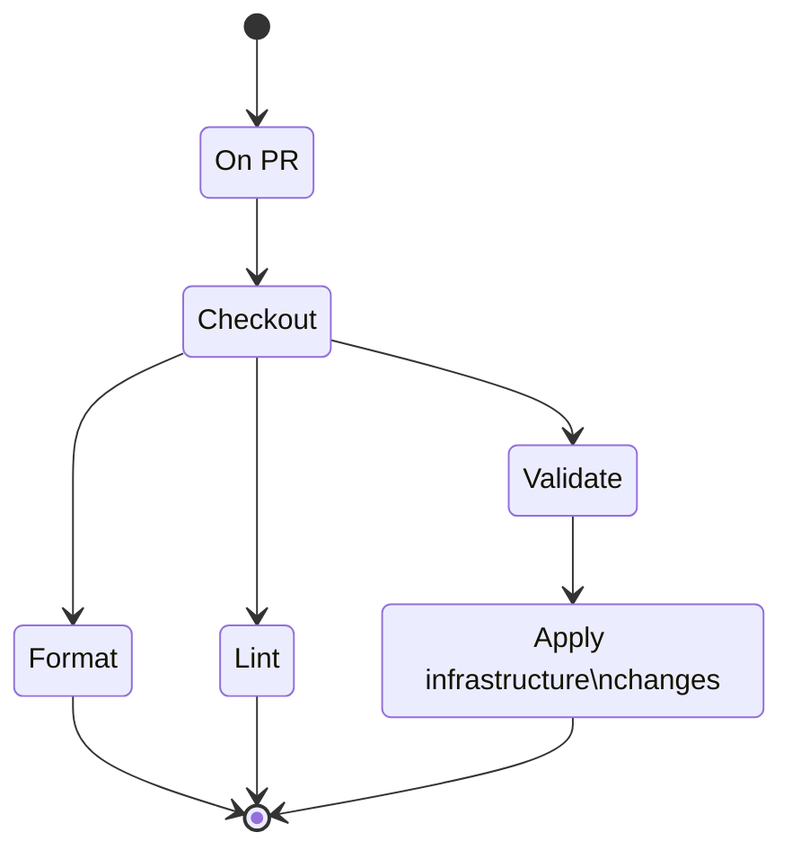

# Пайплайни

Пайплайните са дефинирани като GitHub Actions. Те се изпълняват при конкретно
действие в source control repository-то. Пайплайните се намират в папката `.github/workflows`.
За различните видове код се прилагат различни пайплайни в зависимост от
спецификата на съответната технология.

## Ci/CD за документацията

## CI/CD за кода

## CI/CD за инфраструктурата

### На PR

### На Push

