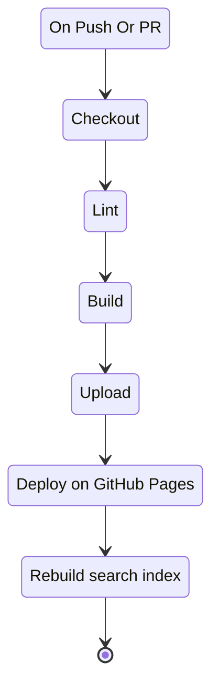
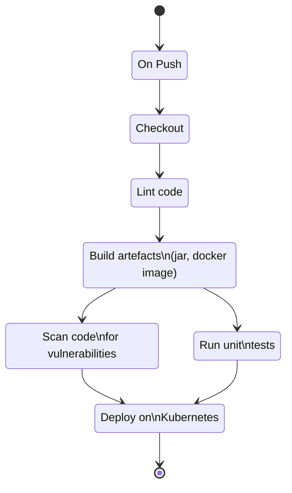

## Ci/CD за документацията


```mermaid
stateDiagram
Trigger : On Push Or PR
Deploy : Deploy on GitHub Pages
RebuildIndex : Rebuild search index

Trigger  --> Checkout
Checkout --> Lint
Lint --> Build
Build --> Upload
Upload --> Deploy
Deploy --> RebuildIndex
RebuildIndex --> [*]
```

## CI/CD за кода


```mermaid
stateDiagram
Trigger : On Push
Lint : Lint code
Build : Build artefacts\n(jar, docker image)
Scan : Scan code\nfor vulnerabilities
Test : Run unit\ntests
Deploy : Deploy on\nKubernetes
[*] --> Trigger
Trigger --> Checkout
Checkout --> Lint
Lint --> Build
Build --> Scan
Build --> Test
Scan --> Deploy
Test --> Deploy
Deploy --> [*]
```

## CI/CD за инфраструктурата

```mermaid
stateDiagram
Trigger : On Push
Lint : Lint code
